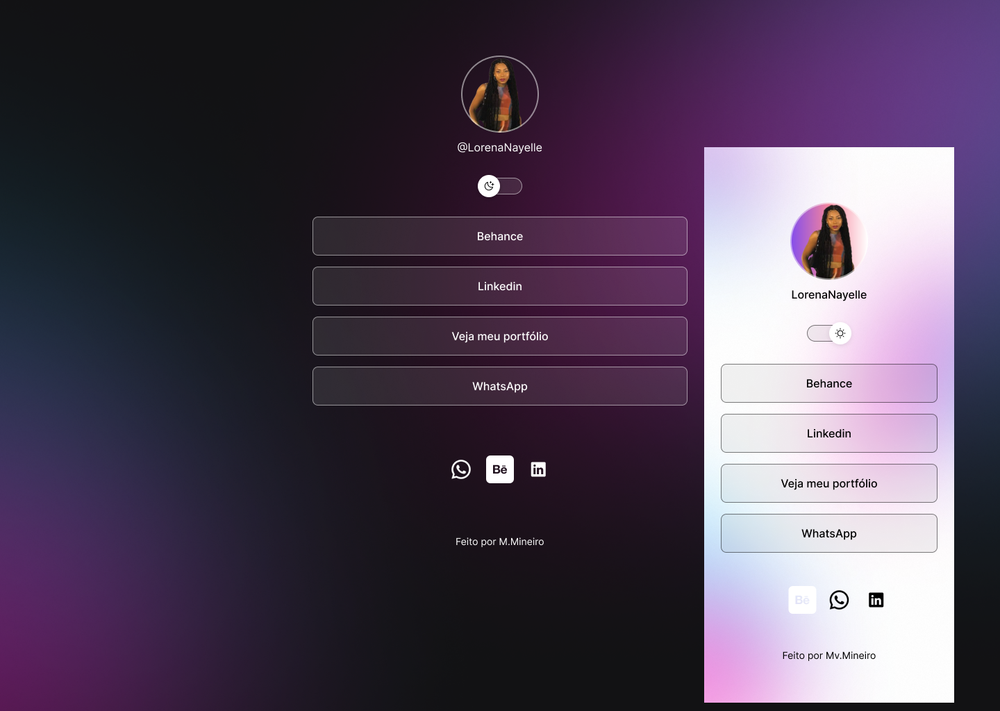

<h1 align="center"> LinksLorena </h1>

  Site de links profissionais na web.

  <a href="#-tecnologias">Behance</a>&nbsp;&nbsp;&nbsp;|&nbsp;&nbsp;&nbsp;
  <a href="#-projeto">Linkedin</a>&nbsp;&nbsp;&nbsp;|&nbsp;&nbsp;&nbsp;
  <a href="#-layout">Portfolio</a>&nbsp;&nbsp;&nbsp;|&nbsp;&nbsp;&nbsp;

  

 

  

## 🚀 Tecnologias

Esse projeto foi desenvolvido com as seguintes tecnologias:

- HTML e CSS
- JavaScript
- Git e Github
- Figma

## 💻 Projeto

O LinksLorena é um agregador de links para usar como cartão de visitas online.

## 🔖 Layout

Você pode visualizar o layout do projeto através [DESSE LINK](https://www.figma.com/design/DZ1w1s5zO9K70QDFBw1r1g/SiteLorena?node-id=3-113&t=qyrDdS6BhCncVZAE-0). É necessário ter conta no [Figma](https://figma.com) para acessá-lo.

## :memo: Licença

Esse projeto está sob a licença MIT.

---

Feito por M.Mineiro :wave: [Entre em contato!](https://www.linkedin.com/in/marcos-mineiro-62a2a719a/)
